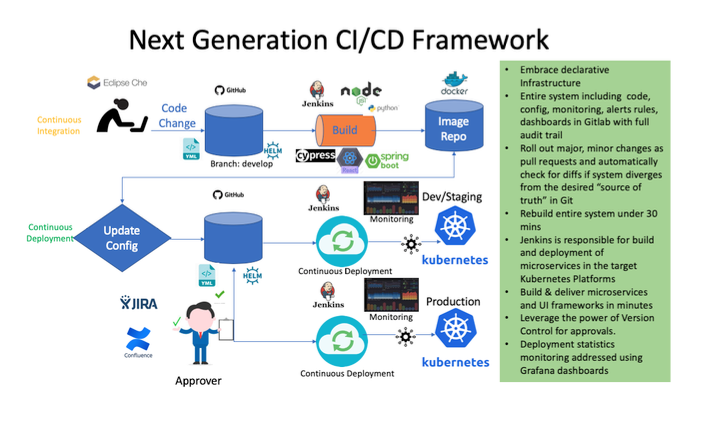

  # NEO Airline’s Digital Engineering Platform

# Background

Neo airline is investing in digital transformation initiatives to address the market and competitive forces that are consolidating through disruptive business models. IT is playing a central role in the digital enablement program with key focus on building strong technology foundations and customer center capabilities. Key focus areas to enhance delivery capabilities are to harness the potential of hybrid cloud, data and analytics, Automation, DevOps and Site reliability practices.

# Challenges
One of the initiatives undertaken by the NEO Airline’s Digital engineering team is to build unified middleware service layer using microservices architecture to serve Omni channels (like desktop app, IOS/Android app and other services). Due to complex technology landscape and systemic issues around environments, the changes to the products are moving too slowly. “Business would come up with a million ideas that would dazzle the end customer, and we’d just tell them, out of your list, pick the two things you’d like to get in the next 6–12 months”. Business had tried hiring and outsourcing their way out of the problem, but nothing had worked. 

# Solution Architecture
Due to a complex technology landscape and systemic issues around environments, it is recommended to deploy the next generation digital engineering platform for Neo Airlines. 
Kubernetes enterprise strategic platform will align with the Neo Airlines Digital Engineering strategy for  a scalable reliable, resilient platform cloud strategy.

One of the main benefits of containerisation is the ability to speed up the process of building, testing, and releasing software. Kubernetes is designed for deployment, and offers several useful features:
– Automated rollouts and rollbacks: Want to roll-out a new version of the app or update its configuration? Kubernetes will handle it for you without downtime, while monitoring the containers’ health during the roll-out. In case of failure, it automatically rolls back.
– Canary Deployments: Canary deployments enable you to test the new deployment in production in parallel with the previous version, before scaling up the new deployment and simultaneously scaling down the previous deployment.
– Programming languages and frameworks support: Kubernetes support a wide spectrum of programming languages and frameworks like Java, Go, .Net, etc. Kubernetes also has a lot of support from the development community, who maintain additional programming languages and frameworks. If an application can run in a container, it should run well on Kubernetes.


                                        

# Build Jenkins Instance as Docker in AWS

There is requirement to build new jenkins for the new Kubernetes cluster 1.14.1

## Usage 

Change the inventory.yml file to provide the jenkins instance name, VPC ID, subnets, ssh_private_key  etc
Run the below command to install the jenkins instance

```bash
ansible-playbook ec2_jenkins.yml -i localhost,
```
This playbook will create the below components<br/>
<br/>
a) EC2 instance<br/>
b) format/mount EBS volume for jenkins data <br/>
c) install/enable docker <br/> 
d) install jenkins as docker and use EBS volume for the /var/jenkins_home <br/>
e) Create Application Load balancer and target groups <br/>
f) Add instance into ALB <br/>
g) Create route53 entry to point new jenkins to ALB <br/>


## Access the jenkins 
ansible playbook will print out the new jenkin url , new url will be "jenkins_instance_name".opendev.engineering

## Configure the jenkins 
ansible playbook will print the last line as initial password to configure the jenkins 


## Contributing
Pull requests are welcome. For major changes, please open an issue first to discuss what you would like to change.

Please make sure to update tests as appropriate.
