  # NEO Airline’s Digital Engineering Platform

# Background

Neo airline is investing in digital transformation initiatives to address the market and competitive forces that are consolidating through disruptive business models. IT is playing a central role in the digital enablement program with key focus on building strong technology foundations and customer center capabilities. Key focus areas to enhance delivery capabilities are to harness the potential of hybrid cloud, data and analytics, Automation, DevOps and Site reliability practices.

# Challenges
One of the initiatives undertaken by the NEO Airline’s Digital engineering team is to build unified middleware service layer using microservices architecture to serve Omni channels (like desktop app, IOS/Android app and other services). Due to complex technology landscape and systemic issues around environments, the changes to the products are moving too slowly. “Business would come up with a million ideas that would dazzle the end customer, and we’d just tell them, out of your list, pick the two things you’d like to get in the next 6–12 months”. Business had tried hiring and outsourcing their way out of the problem, but nothing had worked. 

# CI/CD Solution Architecture
Due to a complex technology landscape and systemic issues around environments, it is recommended to deploy the next generation digital engineering platform for Neo Airlines. 
Kubernetes enterprise strategic platform will align with the Neo Airlines Digital Engineering strategy for  a scalable reliable, resilient platform cloud strategy.

One of the main benefits of containerisation is the ability to speed up the process of building, testing, and releasing software. Kubernetes is designed for deployment, and offers several useful features:
– Automated rollouts and rollbacks: Want to roll-out a new version of the app or update its configuration? Kubernetes will handle it for you without downtime, while monitoring the containers’ health during the roll-out. In case of failure, it automatically rolls back.
– Canary Deployments: Canary deployments enable you to test the new deployment in production in parallel with the previous version, before scaling up the new deployment and simultaneously scaling down the previous deployment.
– Programming languages and frameworks support: Kubernetes support a wide spectrum of programming languages and frameworks like Java, Go, .Net, etc. Kubernetes also has a lot of support from the development community, who maintain additional programming languages and frameworks. If an application can run in a container, it should run well on Kubernetes.

                                       

# Key benefits of the solution:
# Impressive heritage:
Kubernetes has a very mature and proven underlying architecture. Its design is built on over 10 years of operational experience of the Google engineers who helped build and maintain the largest container platform in the world.
# Rich feature set and application support:
Kubernetes has a very rich feature set compared to other container management systems. It supports a wide spectrum of workloads, programming languages and frameworks, enabling stateless, stateful, and data-processing workloads. and making Kubernetes flexible enough to meet the needs of a wide range of users and use cases.
# Workload Scalability
Kubernetes is known to be efficient in its use of infrastructure resources and offers several useful features for scaling purposes:
– Horizontal infrastructure scaling: Kubernetes operates at the individual server level to implement horizontal scaling. New servers can be added or removed easily.
– Auto-scaling: With auto-scaling you can automatically change the number of running containers, based on CPU utilisation or other application-provided metrics.
– Manual scaling: You can manually scale the number of running containers through a command or the interface.
– Replication controller: The Replication controller makes sure your cluster has a specified number of equivalent pods (a group of containers) running. If there are too many pods, the Replication Controller terminates the extra pods. If there are too few, it starts more pods.

# EKS Logical  Architecture
Neo Airlines container platform is built on AWS EKS(Elastic Kubernetes Service) . Amazon EKS Kubernetes is designed to tackle the availability of both applications and infrastructure, making it indispensable when deploying containers in production.

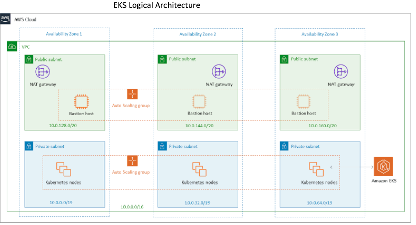

## Solution covers the following deliverables:
1)	A GITHUB repo to demonstrate Infrastructure provisioning templates/files to provision Jenkins.
        
         https://github.com/assign101/iac-jenkins.git
         
        
2)	A GITHUB repo to demonstrate Infrastructure provisioning templates/files to provision “your JAR/WAR” Application environment
    Target application environment is a EKS Kubernetes Cluster. EKS infrastructure was provision manual via AWS management console.
 Screen shots below.
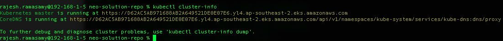
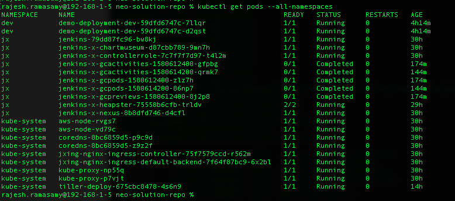
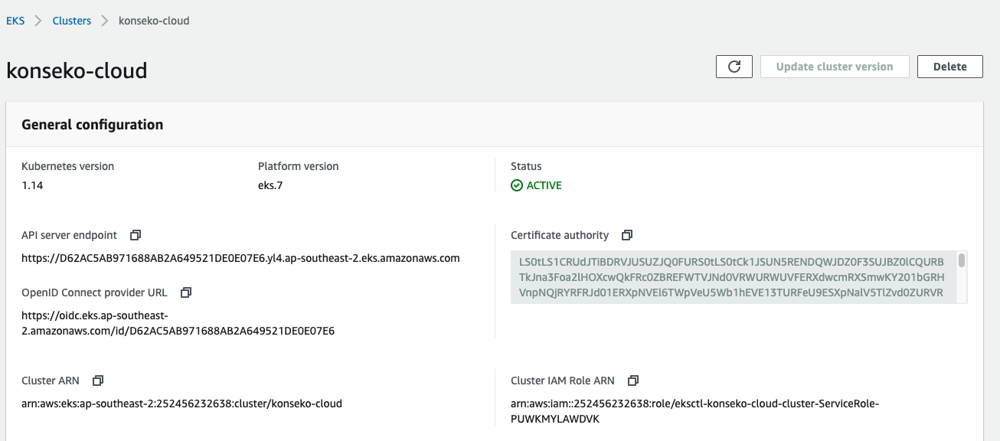
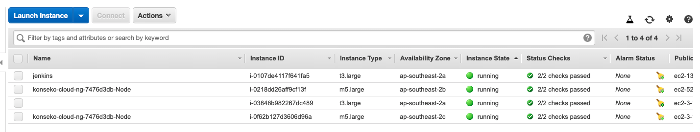

   
3)	Provisioned infrastructure should be well defined with proper tagging and naming conventions.
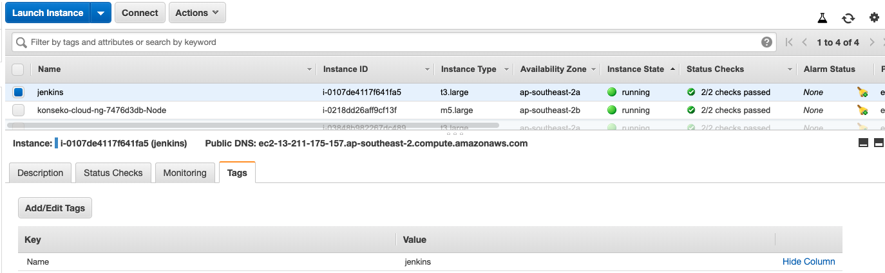
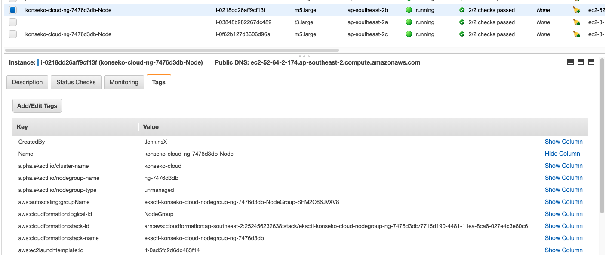

4)	Provisioned infrastructure and deployed services should be secured and have well defined security groups and ACL’s to restrict access.
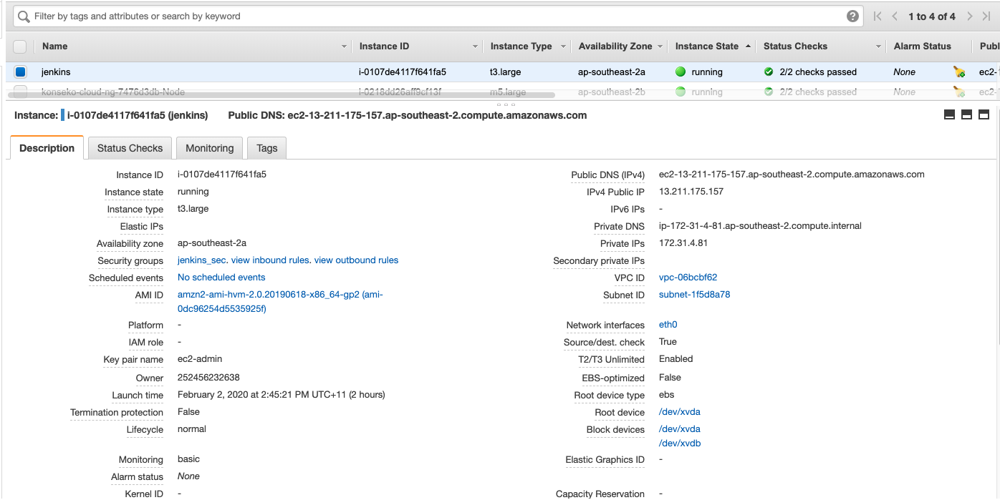
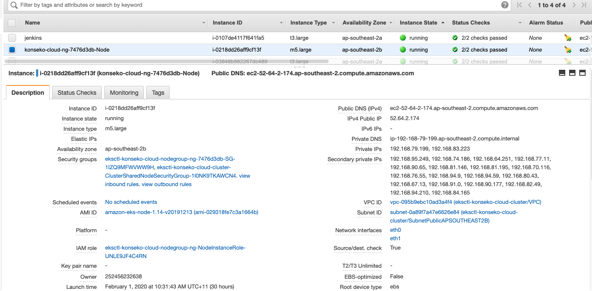

5)	Deploy “Your JAR/WAR” file using the CI/CD pipeline to Test.
       https://github.com/assign101/demo-spring-boot.git
       Branch : develop
    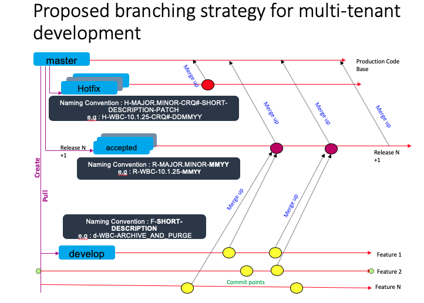
  
   Jenkins URL for CI/CD pipelines :
      http://13.211.175.157:8080
      user: admin/welcome123
         
 Provisioned pods
 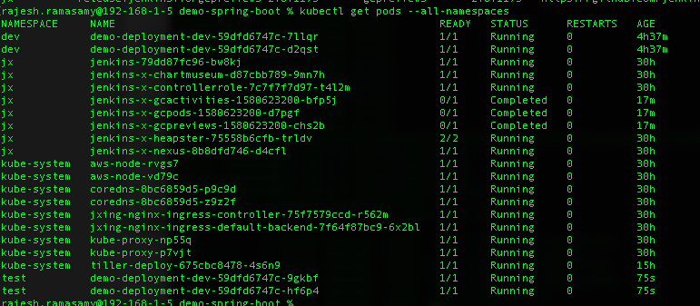
       
   Jenkins Pipelines:
 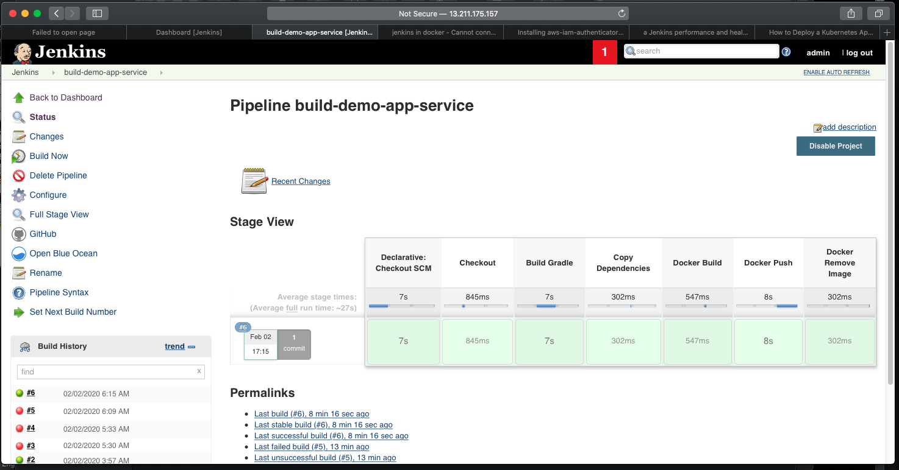
 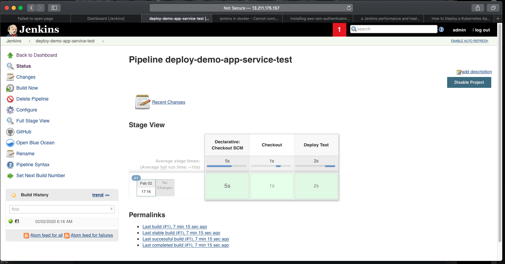
   

 
6)	Instrumentation of CI/CD pipelines with monitoring to present number of deployments, using a presentation layer like Grafana.

https://github.com/assign101/monitoring.git

A High-level architecture to demonstrate how you approached the problem and your solution is required.
Explanation of the code and working demo of Jenkins pipeline is required.

Explained above
